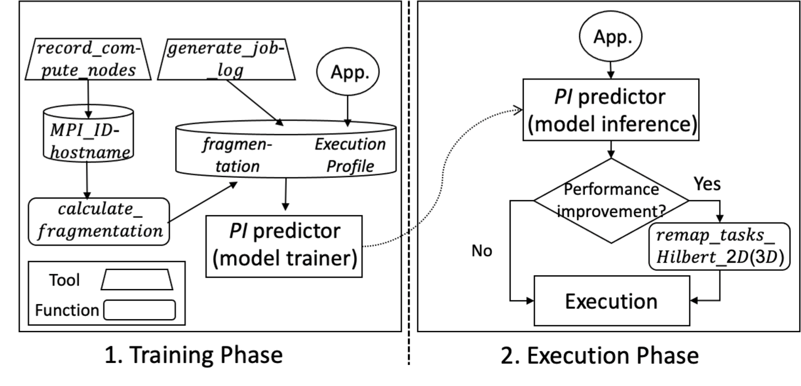

# Task-mapping Library using a Space-filling curve

## Introduction

A task-mapping library is developed using the space-filling curve to improve the communication performance of parallel applications with structured grids in Cartesian coordinate. The library includes public APIs and tools for application developers (see table below). Main functionality of the library is to remap tasks to computational resources along the Hilbert curve.
The tools for the performance analysis are accompanied as well. 
The library is implemented in Fortran and some APIs are also developed in C language.

| Name | Functionality | Languages | 
| ------------- | ------------- | --------- | 
| remap\_tasks\_Hilbert\_2D(3D) | Function for Hilbert-curve-based task-mapping for 2D(3D) | Fortran and C |
| calculate\_fragmentation\_2D(3D) | Function to calculate the fragmentation for 2D(3D)  | Fortran | 
| record\_compute\_nodes | A tool to record list of MPI\_ID-hostname pairs | Fortran |
| generate\_job\_log | A tool to generate job log including execution info. \& fragmentation | Fortran |

Following figure illustrates the task-mapping workflow using the library APIs and tools. The workflow has two phases: (a) training and (b) execution phase. In the training phase, the $PIR$ (performance improvement ratio) predictor is trained using the execution profile and fragmentation value. The $PIR$ is defined as the ratio of the elapsed application time between with and without the proposed strategy. 
In the execution phase, the task-remapping is performed only when the predictor expects improvement (PIR > 1). Below we describe details of the task-mapping library and then how to install and run it.



## APIs and Tools
### Functions for Hilbert-curve-based task-mapping
```
/* a task-mapping function in C language */
void remap_tasks_Hilbert_2D(int Nx, 
                            int Ny, 
                            MPI_Comm *cur_comm, 
                            MPI_Comm *new_comm);
                            
! task-mapping functions in Fortran language 
subroutine remap_tasks_Hilbert_2D(Nx, Ny, cur_comm, new_comm)
subroutine remap_tasks_Hilbert_3D(Nx, Ny, Nz, cur_comm, new_comm)
```
The *remap\_tasks\_Hilbert\_2D(3D)* functions are provided to application developers for 2D(3D) domain decomposition. The functions could be easily incorporated just after calling *MPI\_Init* function. The purpose of the functions is to reassign the tasks (MPI processes) according to the Hilbert-curve-based strategy upon 2D(3D) domain decomposition. They first generate a list of remapped-tasks depending on domain decomposition strategy. 
For example, as for 2D decomposition, a new order of tasks in the remapping is obtained from the input parameters, i.e, *Nx*, *Ny* and *cur\_comm*. The *Nx* and *Ny* specifies the number of processes in each dimension. And the *cur\_comm* specifies the current MPI communicator including the list of tasks, e.g. *MPI\_COMM\_WORLD. It then creates and returns a new MPI communicator(*new\_comm*) from the new order of tasks. 

###  Functions to calculate the fragmentation
```
! fragmentation-calculating functions in Fortran language 
! at edge level switch for 2D domain decomposition 
subroutine calculate_fragmentation_2D_edge_level_x(
                    Nx, Ny, fragmentation, hilbert)
subroutine calculate_fragmentation_2D_edge_level_y(
                    Nx, Ny, fragmentation, hilbert)
! at core level switch for 2D domain decomposition 
subroutine calculate_fragmentation_2D_core_level_x(
                    Nx, Ny, fragmentation, hilbert)
subroutine calculate_fragmentation_2D_core_level_y(
                    Nx, Ny, fragmentation, hilbert)
! at edge level switch for 3D domain decomposition 
subroutine calculate_fragmentation_3D_edge_level_x(
                    Nx, Ny, Nz, fragmentation, hilbert)
subroutine calculate_fragmentation_3D_edge_level_y(
                    Nx, Ny, Nz, fragmentation, hilbert)
subroutine calculate_fragmentation_3D_edge_level_z(
                    Nx, Ny, Nz, fragmentation, hilbert)
! at core level switch for 3D domain decomposition              
subroutine calculate_fragmentation_3D_core_level_x(
                    Nx, Ny, Nz, fragmentation, hilbert)
subroutine calculate_fragmentation_3D_core_level_y(
                    Nx, Ny, Nz, fragmentation, hilbert)
subroutine calculate_fragmentation_3D_core_level_z(
                    Nx, Ny, Nz, fragmentation, hilbert)
```
The *calculate\_fragmentation\_2D($3D$)\_edge(core)\_level\_x(y|z)* functions are provided for applications using 2D(3D) domain decomposition. The *Nx*, *Ny* and *Nz* specifies the number of processes in each dimension. And *hilbert* specifies whether it is calculated with the Hilbert-based method or not. 
Each function calculates the task fragmentation (*fragmentation*) in the communicator(*x*-axis, *y*-axis, or *z*-axis) at the level (*edge* or *core* level switch) of the system topology. It requires the information of switch levels of hosts. It could use the physical topology file (*readfile\_from\_node.list*) which is statically generated from the service that manages the interconnection network, e.g., Fabric Manager. 

### *record\_compute\_nodes* Tool
The *record\_compute\_nodes* tool records a list of compute resources allocated to the given MPI tasks according to the domain decomposition strategy. Specifically, it generates a *stdout* file containing a list of *MPI\_ID-hostname* pairs, i.e., MPI task IDs and their host mappings. This list is further leveraged to compute the fragmentation of the currently mapped tasks. 

### *generate\_job\_log* Tool
The *generate\_job\_log* tool generates log data including execution profile and fragmentation value of jobs to analyze performance.  
It first reads the list of *MPI\_ID-hostname* pairs generated by the *record\_computed\_nodes* tool. It then calculates the task fragmentation in each communicator at each level of the system topology by invoking the *calculate\_fragmentation* function. The tool outputs a csv (comma-separated values) file containing the job log.

## Directory structure

Following is directory structure.
1. APIs
- The library is provided as both C functions and Fortran module, in separate sub-directories. Each sub-directory has its source code and Makefile to build the library. After building of C functions, the sub-directory will have *hilbert.o* and *hilbert.h*. Also, after building of Fortran modules, the sub-directory will have *calculate\_fragmentation\_2D.mod*, *calculate\_fragmentation\_3D.mod*, and *hilbert.mod*.
2. Tools
- This directory contains two core tools for performance analysis and the development of $PIR$ predictor; *record\_compute\_nodes* and *generate\_job\_log*, in separate sub-directories. Each has its source code and Makefile to build the tool. *generate\_job\_log* has two Examples (for P3DFFT solver and Poisson solver), in separate sub-directories. 
3. Examples
- This directory has two example programs (P3DFFT solver and Poisson solver) in Fortran, in separate sub-directories. Each has its working directory to contain the example of a batch job script and an input parameter. The batch job script includes the two versions of the workload and execute them one after another. P3DFFT solver has patch files to adapt the Hilbert-based strategy. Poisson solver has its source code to build executable files. The baseline and Hilbert executable is to be built from source files using a *make* command. 

## Installation and Execution

### Two workloads to exploit the Hilbert-based strategy
Two examples (P3DFFT solver and Poisson solver) are given to compare the performance between the baseline and the Hilbert-based strategy. The baseline and Hilbert executable is to be built from source files using a *make* command.   

#### P3DFFT solver
P3DFFT solver is a popular software package to implement fast Fourier trans-forms  (FFTs)  in  three  dimensions  in  a  highly  efficient  and  scalable  way.   It exploits  a  2D  domain  decomposition  strategy.   It  needs  to  build  two  versions(baseline and Hilbert executable) of P3DFFT solver and execute them one afteranother. Patch  files  are  given  to  build  Hilbert  version.   
The details of installation and exeuction are described at README.pdf file in root directory.

#### Poisson solver
The Poisson solver is a parallel solver of the Poisson equation with Multigrid method. Unlike previous workload, this code adapts a 3D domain decomposition strategy.
Two versions (baseline and Hilbert executable) of Poisson solver are needed and executed them one after another. 
The details of installation and exeuction are described at README.pdf file in in root directory.


    


